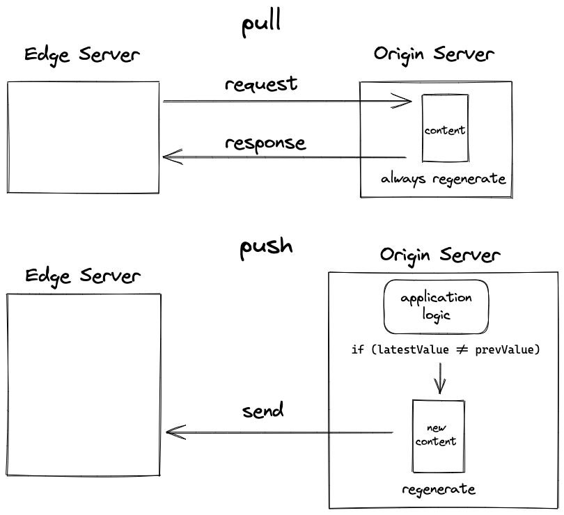
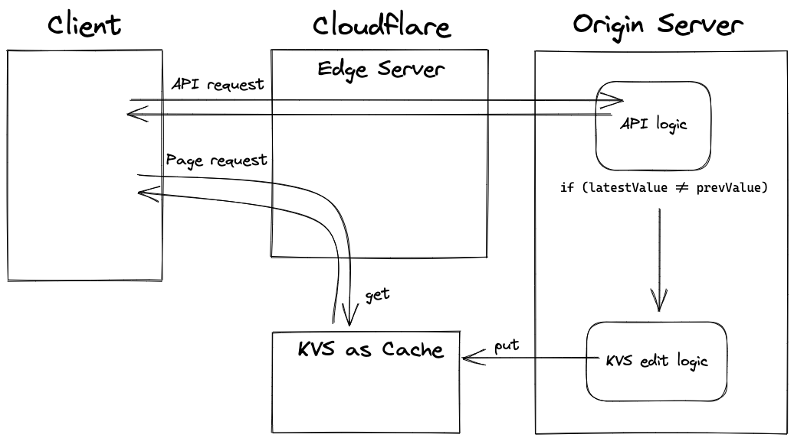

# use KVS as cache architecture

Experimental architecture using Cloudflare Workers KV.

Push-type cache design is realize.



Cloudflare Workers KV is used as cache.



## Development

### Application

Using Deno `v1.11.3`.  
It uses unstable features, so other versions may not work.

Need following environment variable.

```
ENVIRONMENT=<development or production>
ACCOUNT_ID=<Cloudflare account id>
ZONE_ID=<Cloudflare zone id>
NAMESPACE_ID=<Cloudflare Workers KV namespace id>
CF_API_KEY=<Cloudflare Global API Key>
CF_VERIFIED_EMAIL=<Email address registered in Cloudflare>
APP_PAGE_URL=<site url>
```

In the development environment, write this in `.env`.  
You will also need to set this in your production environment.

Run development environment.

```
$ deno run --watch --allow-net --allow-read --allow-write --allow-env --unstable server.jsx
```

[http://localhost:8080/](http://localhost:8080/) is App page, [http://localhost:8080/admin](http://localhost:8080/admin) is Admin page.

`Procfile` and `runtime.txt` files are required to deploy to Heroku.  
If you are deploying to other platforms, these files are not used.

### Cloudflare Workers script

Need to create a KV with a namespace of `MY_KV` by running the following command.

```
$ wrangler kv:namespace create "MY_KV"
$ wrangler kv:namespace create "MY_KV" --preview
```

And prepare a file `workers/wrangler.toml` with the following contents.

```toml
name = "my-worker-kv"
type = "javascript"

account_id = "<Cloudflare account id>"
workers_dev = false

[env.preview]
route = "<site domain>/*"
zone_id = "<Cloudflare zone id>"
kv_namespaces = [
  { binding = "MY_KV", preview_id = "<Cloudflare Workers KV preview namespace id>" }
]
vars = { APP_PAGE_URL = "<site url>" }

[env.production]
route = "<site domain>/*"
zone_id = "<Cloudflare zone id>"
kv_namespaces = [
  { binding = "MY_KV", id = "<Cloudflare Workers KV production namespace id>" }
]
vars = { APP_PAGE_URL = "<site url>" }
```

You can run command in the `workers/` directory.

```
// Run development environment.
$ wrangler dev --env preview
```

```
// Deploy
$ wrangler publish --env production
```

## Settings

Editable item in source.

- `TTL_OF_APP_PAGE_HTML_KV`
  - TTL of KV to be used as cache.
- `getInventoryState`
  - Logic to determine `inventoryState`.

## Other

Image used.

[https://unsplash.com/photos/6QyoveETulU](https://unsplash.com/photos/6QyoveETulU)
